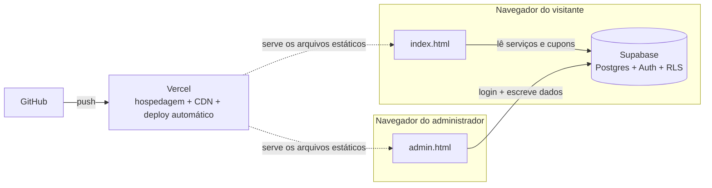

# Megaport Serviços — Site Institucional + Painel Administrativo

Site institucional completo para uma empresa de facilities (portaria, zeladoria, limpeza, manutenção, jardinagem e controle de pombos), com painel administrativo real conectado a um banco de dados — sem CMS pronto, sem WordPress, construído do zero.

**[Ver site no ar →](#)** &nbsp;·&nbsp; **[Ver painel admin →](#)**
<sub>*(substitua pelos links depois do deploy — veja `SETUP.md`)*</sub>


<sub>*Fluxo real gravado do painel: login → adicionar serviço → salvo e visível no site, sem passo de "publicar".*</sub>

---

## O desafio e a solução

**O problema:** a Megaport precisava de um site que passasse credibilidade — cores e identidade extraídas do material de marca já existente da empresa — e que desse ao dono do negócio autonomia real para manter serviços e promoções atualizados, sem depender de um desenvolvedor a cada pequena alteração.

O desafio interessante aqui não foi só o front-end: foi entregar uma experiência de **CRUD completo, com autenticação e permissões de verdade**, dentro do orçamento e da simplicidade operacional de um site institucional pequeno — sem virar um projeto de meses, sem servidor próprio, e sem cair na armadilha comum de "senha escondida no JavaScript" fingindo ser segurança.

| Necessidade | Caminho tradicional | Escolha neste projeto |
|---|---|---|
| Banco de dados | Servidor próprio + administração de banco | Supabase (Postgres gerenciado, plano gratuito) |
| Login/autenticação | Sistema de auth construído do zero | Supabase Auth (pronto, testado, seguro) |
| "Só o dono edita" | Lógica de permissão no back-end próprio | Row Level Security no banco — a regra vive no banco, não no código |
| Publicar o site | Subir arquivo por FTP a cada mudança | GitHub → Vercel, deploy automático a cada push |
| Custo de operação | Servidor mensal | R$ 0 até um volume de tráfego bem acima do esperado |

O resultado final é um site que **parece** simples (HTML/CSS/JS estático) mas **funciona** como uma aplicação completa por trás — só que sem nenhuma das dores de operação que normalmente vêm junto.

## Funcionalidades

- **Site responsivo**, construído com HTML/CSS/JS puro — sem framework, sem processo de build
- **Painel administrativo** (`admin.html`) com login real, onde o cliente cadastra e edita serviços e cupons de promoção
- **Alterações em tempo real**: o que o cliente salva no painel aparece pro site inteiro na hora, para qualquer visitante — sem passo manual de "publicar"
- **Autenticação e permissões de verdade** via Supabase Auth — só um usuário logado pode escrever no banco; qualquer visitante só consegue ler os dados públicos (Row Level Security no banco, não confiança no front-end)
- **Seção de promoções dinâmica** — aparece e desaparece sozinha dependendo de haver ou não cupons ativos e dentro da validade
- **Deploy contínuo**: qualquer alteração de código sobe automaticamente ao dar push no repositório (Vercel + GitHub)
- Popup de redes sociais configurável, com controle de frequência de exibição
- Ícones desenhados sob medida (SVG) para bater exatamente com a identidade visual da marca
- Fotos reais da equipe integradas ao design (fundo de card, galeria), no lugar de bancos de imagem genéricos
- Prévia de compartilhamento (Open Graph) personalizada para WhatsApp/redes sociais

## Arquitetura



O front-end nunca decide sozinho quem pode escrever no banco — isso é reforçado a nível de banco de dados com políticas de **Row Level Security**: qualquer papel `anon` (visitante) só tem permissão de `SELECT`; escrita (`INSERT`/`UPDATE`/`DELETE`) exige um papel `authenticated` válido. Ver `supabase/schema.sql`.

## Tech stack

| Camada | Tecnologia |
|---|---|
| Front-end | HTML5, CSS3 (custom properties, grid/flexbox), JavaScript (vanilla, sem framework) |
| Backend / Dados | [Supabase](https://supabase.com) (Postgres, Auth, Row Level Security, API REST automática) |
| Hospedagem | [Vercel](https://vercel.com) (CDN global, deploy automático) |
| Versionamento / CI-CD | GitHub → Vercel (deploy a cada push) |

Sem dependências de build — os arquivos são servidos exatamente como estão no repositório.

## Estrutura do projeto

```
megaport-site/
├── index.html              → Site público
├── admin.html                → Painel administrativo
├── css/
│   ├── style.css              → Estilos do site
│   └── admin.css               → Estilos do painel
├── js/
│   ├── script.js                → Lógica do site (busca dados, popup, menu, animações)
│   ├── admin.js                   → Lógica do painel (autenticação, CRUD)
│   ├── icons.js                     → Biblioteca de ícones SVG compartilhada
│   ├── supabase-config.js            → Credenciais de conexão com o Supabase
│   └── vendor/supabase.js              → Cliente oficial do Supabase (incluído localmente)
├── supabase/
│   └── schema.sql                       → Schema do banco + políticas de segurança (RLS)
├── images/                                → Logo, selos e fotos usadas no site
├── docs/
│   └── demo-admin.gif                     → GIF de demonstração usado neste README
├── SETUP.md                                → Passo a passo de configuração e deploy
├── CUSTOMIZATION.md                          → Guia de operação do dia a dia (para o dono do site)
└── README.md                                → Este arquivo
```

## Rodando localmente

Não precisa de servidor nem instalação — os arquivos são estáticos e os dados vêm da internet (Supabase):

```bash
git clone <url-do-repositorio>
cd megaport-site
# preencha js/supabase-config.js com suas credenciais (veja SETUP.md)
# abra index.html direto no navegador
```

Para configurar o banco de dados do zero (Supabase + Vercel + GitHub, gratuito), siga o **[`SETUP.md`](./SETUP.md)** — é o passo a passo completo, sem pular etapas. Para o dia a dia de operação do site (trocar textos, fotos, cores), veja o **[`CUSTOMIZATION.md`](./CUSTOMIZATION.md)**.

## Decisões de design

- **Sem framework de front-end**: dado o tamanho do projeto, um framework (React/Vue) adicionaria complexidade de build sem ganho real — HTML/CSS/JS direto mantém o site leve e fácil de hospedar em qualquer lugar.
- **Supabase em vez de backend próprio**: entrega banco de dados, autenticação e API com poucas linhas de configuração, no plano gratuito, sem precisar manter servidor.
- **RLS em vez de checagem só no front-end**: a permissão de escrita é garantida pelo próprio banco de dados — mesmo que alguém adultere o JavaScript do navegador, o banco recusa a operação sem uma sessão autenticada válida.

## Possíveis evoluções

- Upload de imagens direto pelo painel (Supabase Storage)
- Reordenar serviços por arrastar-e-soltar
- Múltiplos usuários administradores com permissões diferentes
- Métricas de cliques nos botões de WhatsApp

---

<sub>Projeto desenvolvido sob medida para a Megaport Portaria e Zeladoria Ltda.</sub>
